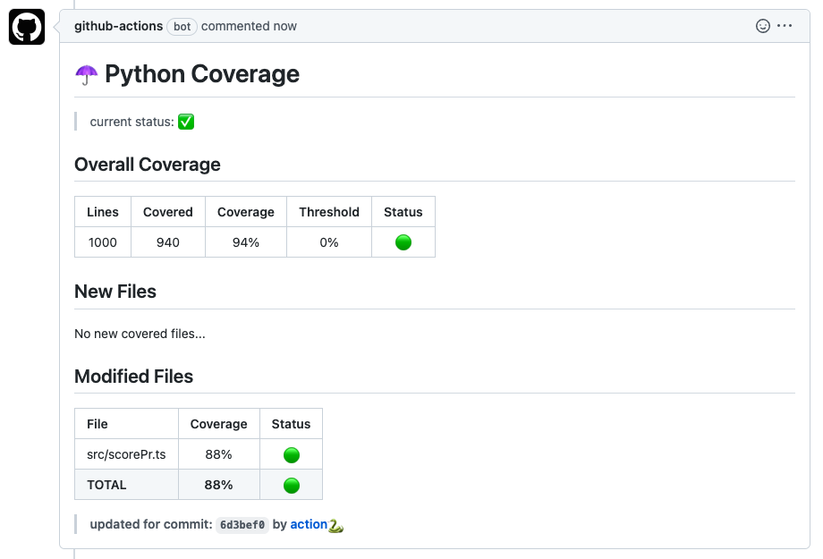

# Python Coverage: The Esential Coverage Reporter GitHub Action for python

> ☂️ parse and publish coverage xml to a PR, enforce coverage rate on new & modified files

## Usage

Create a new workflow `.yml` file in the `.github/workflows/` directory.

You can create a coverage report using python:
 - pytest `$ pytest --cov-report xml:path/to/coverage.xml`
 - coverage `$ coverage xml path/to/coverage.xml`

### Minimal Configuration
```yml
name: 'coverage'
on:
    pull_request:
        branches:
            - master
            - main
jobs:
    coverage:
        runs-on: ubuntu-latest
        steps:
          - name: Get Cover 
            uses: orgoro/coverage@v3
            with:
                coverageFile: path/to/coverage.xml
                token: ${{ secrets.GITHUB_TOKEN }}
```
## PR Message & Job Summary 🆕



## Inputs

| Input               | Optional  | Description                                      | Example                |
|---------------------|-----------|--------------------------------------------------|------------------------|
| `coverageFile`      |           | path to .xml coverage report                     | ./path/to/coverage.xml |
| `token`             |           | your github token                                | 🤫                     |
| `thresholdAll`      | ✅        | the minimal average line coverage                | 0.8                    |
| `thresholdNew`      | ✅        | the minimal average new files line coverage      | 0.9                    |
| `thresholdModified` | ✅        | the minimal average modified files line coverage | 0.0                    |
| `passIcon`          | ✅        | the indicator to use for files that passed       | 🟢                      |
| `failIcon`          | ✅        | the indicator to use for files that passed       | 🔴                      |

## Privacy

This Action contacts Chainguard's licensing server to verify authorization. Connection metadata (IP address, GitHub repository identifier, timestamp, and any metadata encoded in the auth token) is transmitted to Chainguard, Inc. even if authorization is denied in accordance with our [Privacy Notice](https://www.chainguard.dev/legal/privacy-notice)
